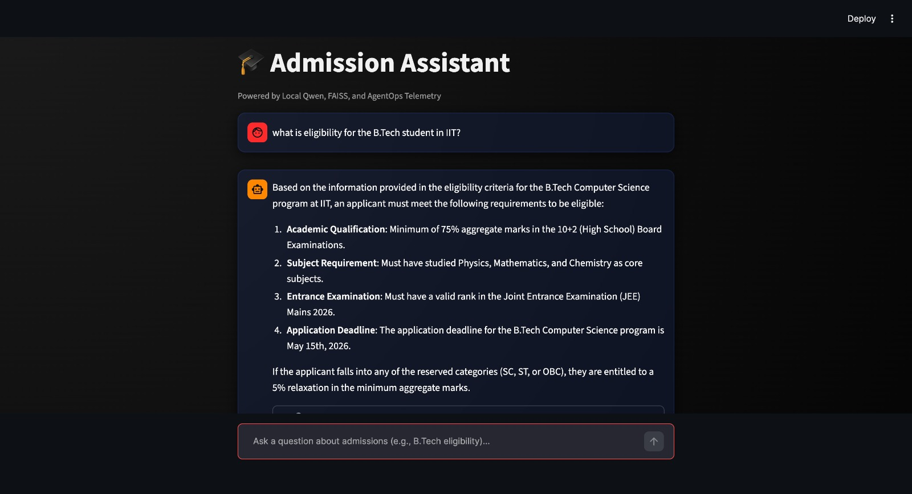
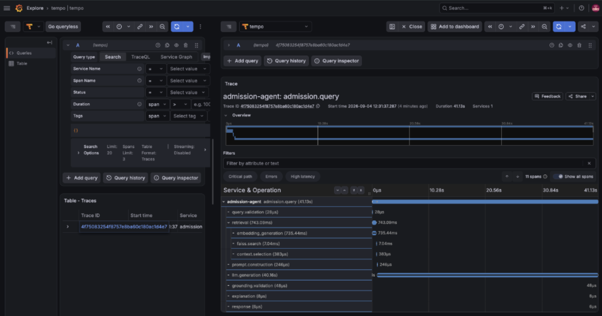

# AgentOps and Explainability for a Local Admission Information Agent

<p align="center">
  
  
</p>

## 📖 Overview
This project builds a robust, privacy-safe, local-first AI agent designed to answer university admission queries. Unlike standard RAG (Retrieval-Augmented Generation) applications, the core engineering focus of this project is **Instrumentation-by-Design**. 

By building an embedded observability layer (AgentOps) utilizing the OpenTelemetry standard, we conduct a controlled experiment to measure the exact value of telemetry in diagnosing failures, tracking execution traces, and providing explainable AI responses.

## 🏗 Architecture
The system employs a strict Dual-Path Architecture to ensure observability does not interfere with functional logic:

### 1. The Functional AI Pipeline
- **Stack:** Local Qwen 2.5 LLM (Ollama), FAISS (Vector DB), FastAPI, Streamlit
- **Flow:** Student Query ➔ Retrieval (Semantic) ➔ Prompt Construction ➔ LLM Generation ➔ Explainable Final Response.

### 2. The AgentOps Trace Pipeline
- **Stack:** OpenTelemetry Python SDK, OpenTelemetry Collector, Grafana Tempo
- **Flow:** Code Instrumentation ➔ `localhost:4317` (Collector) ➔ Tempo Storage ➔ Grafana Visualization.
- **Trace Contract:** The system enforces an 11-step cascading waterfall trace (e.g., `admission.query`, `faiss.search`, `llm.generation`) to isolate bottlenecks and categorize failure taxonomies automatically.

## 🚀 Getting Started

### Hardware Requirements
- Apple Silicon Mac (M-series) with at least 8-16 GB unified memory.

### Setup Instructions
1. **Start the AI Engine:**
   ```bash
   ollama serve
   ```
2. **Start the Observability Backend:**
   ```bash
   docker-compose up -d
   ```
3. **Start the FastAPI Backend:**
   ```bash
   python -m uvicorn src.agent.api:app --port 8000
   ```
4. **Start the Streamlit UI:**
   ```bash
   python -m streamlit run ui/app.py --server.port 8501
   ```

## 🧪 Experimentation & Metrics
The final phase of this project involves executing a controlled **"AgentOps ON vs OFF"** experiment. By injecting intentional failures (e.g., database timeouts `RETRIEVAL_DB_OUTAGE`), we quantitatively measure:
1. Trace Completeness & Visibility
2. Diagnosis Time (Mean Time to Resolution)
3. Telemetry Overhead (Cost of observability on CPU and Latency)
